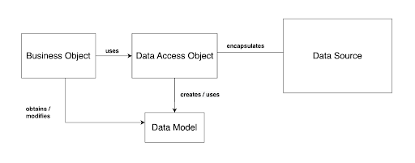
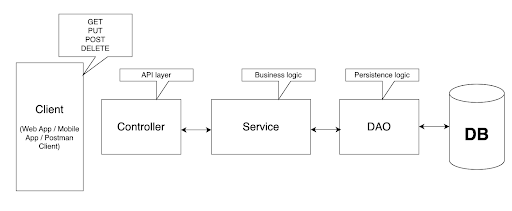
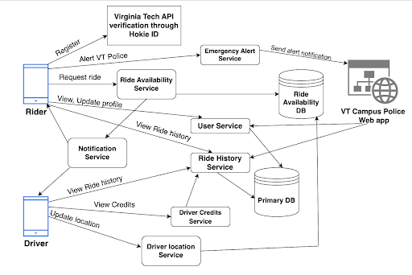

All functionality will be developed using APIs as it can be used between all platforms meaning mobile applications, web-based applications or any other user interface.
In a client-server architecture, Representational state transfer (REST) is a kind of software architecture that describes a consistent interface between physically distinct components, frequently over the Internet. 
REST API is designed around resources which can be business entities of your application. In our case the entities are mainly the users of the application - drivers and riders, Ride, Location and Car.
The most common operations on these resources are GET, POST, PUT, PATCH, and DELETE.

We will be using the Data Access Object (DAO) design pattern in our REST API, as shown in the diagram below.

<figure>
  
  <figcaption>DAO design pattern for REST API.</figcaption>
</figure>

## DAO

DAO stands for Data Access Object. The data persistence logic is separated into a distinct layer using the DAO Design Pattern. The service is fully kept in the dark regarding how the low-level actions to access the database are carried out in this fashion. This is known as the principle of Separation of Logic.

## MVC pattern

The overall architecture of the system would be similar to MVC architecture where View would be the client side of the application - mobile/web application, Controller, Service and DAO would be the server side of the application or the REST API layer of the application. Services contain the business logic of the application and DAO layer would contain the data persistence logic and each entity would have its own DAO class. The diagram below shows the MVC design pattern that can be applied to the current system.

<figure>
  
  <figcaption>MVC pattern for the system</figcaption>
</figure>

## System Components and General Flow

The diagram below represents various components or services and their relationship within the application.

<figure>
  
  <figcaption>System Components and general flow</figcaption>
</figure>

- Initially, both riders and drivers will have to verify their accounts through the external Virginia Tech API. The Hokie ID would be used as an identifier. 
- Riders and drivers can view or update their profiles and UserService would be used for these operations. It would fetch/update records from the primary DB (MongoDB).
- Rider Availability Service would process requests from riders to search for all nearby available drivers that are heading in the same direction or within a 2 mile radius of the driver’s chosen destination. It would get the data from the cache i.e. the Ride Availability database (SQL).
- Riders and drivers can view their past rides taken or rides offered using the Ride History Service which would retrieve data from Primary DB.
- Drivers can view their credits earned in their Hokie Wallet based on the rides offered. This processing would be done by the Driver Credits Service. 
- The location and ETA would be constantly updated as the driver moves. The Driver Location Service would constantly update the location coordinates of the driver’s car using GPS and store the latest coordinates into the cache.
- The Notification Service would process notification requests to various channels like SMS, email, VT campus police web applications.
- The Emergency Alert Service will send a notification to the campus police department for assistance.

## API Endpoints

All REST API endpoints should be private or protected in some fashion for the initial set of requirements. We don't want any anonymous sources to be able to use the API.

Some of the API endpoints would be as follows:

- Mobile application for drivers and riders -

<table>
  <thead>
    <tr>
      <th>API Endpoint</th>
      <th>Method</th>
      <th>Description</th>
    </tr>
  </thead>
  <tbody>
    <tr>
      <td>/user/login</td>
      <td>POST</td> 
      <td>Accepts credentials from driver/rider and returns API token.</td> 
    </tr>
    <tr>
      <td>/user/register</td>
      <td>POST</td>
      <td>Accepts registration details from drivers and riders.</td>
    </tr>
    <tr>
      <td>/user/:id</td>
      <td>GET</td>
      <td>Gets user profile information.</td>
    </tr>
    <tr>
      <td>/user/:id</td>
      <td>POST</td>
      <td>Updates user profile information.</td>
    </tr>
    <tr>
      <td>/user/:id/rides</td>
      <td>GET</td>
      <td>Fetches history rides - rides offered for driver and ride taken for rider.</td>
    </tr>
    <tr>
      <td>/user/:id/verify</td>
      <td>POST</td>
      <td>Verifies the rider/driver account through an external API call to Virginia Tech’s system/API using HokieID as the identifier.</td>
    </tr>
    <tr>
      <td>/ride/search/:{request}</td>
      <td>POST</td>
      <td>Search for all nearby available drivers that are heading in the same direction of the driver’s chosen destination.</td>
    </tr>
    <tr>
      <td>/ride/cancel/:id</td>
      <td>POST</td>
      <td>Cancels a ride - rider and notifies on SMS and Email</td>
    </tr>
    <tr>
      <td>/ride/start/:id</td>
      <td>POST</td>
      <td>Starts a ride - driver and notifies on SMS and Email</td>
    </tr>
    <tr>
      <td>/ride/end/:id</td>
      <td>POST</td>
      <td>Ends a ride - rider and driver and notifies on SMS and Email</td>
    </tr>
    <tr>
      <td>/ride/join/:id</td>
      <td>POST</td>
      <td>Join a ride - rider and notifies on SMS and Email</td>
    </tr>
    <tr>
      <td>/ride/update</td>
      <td>POST</td>
      <td>Constantly updates the ride's current location and the ETA to the destination.</td>
    </tr>
    <tr>
      <td>/ride/create</td>
      <td>POST</td>
      <td>Creates a ride with specific source, destination, car capacity - driver</td>
    </tr>
    <tr>
      <td>/ride/driver/rate</td>
      <td>POST</td>
      <td>Rate the driver for the particular ride</td>
    </tr>
    <tr>
      <td>/ride/rider/rate</td>
      <td>POST</td>
      <td>Rate the rider for the particular ride</td>
    </tr>
    <tr>
      <td>/driver/processCredits</td>
      <td>POST</td>
      <td>Accumulates points to be transferred as a deposit into Hokie Wallet.</td>
    </tr>
    <tr>
      <td>/sendAlert</td>
      <td>POST</td>
      <td>Send out a notification to the web-based application to alert the police of a potential incident.</td>
    </tr>
  </tbody>
</table>

- Web-based application for VT campus police -

<table>
  <thead>
    <tr>
      <th>API Endpoint</th>
      <th>Method</th>
      <th>Description</th>
    </tr>
  </thead>
  <tbody>
    <tr>
      <td>/user/search/{param}</td>
      <td>GET</td> 
      <td>Allows officers to look up users by {param} - first name and last name, and also HokieID.</td> 
    </tr>
     <tr>
      <td>/user/rideHistory</td>
      <td>GET</td> 
      <td>Gets driver/rider’s ride history.</td> 
    </tr>
     <tr>
      <td>/user/currentRide</td>
      <td>GET</td> 
      <td>Gets driver/rider’s current ride details.</td> 
    </tr>
  </tbody>
</table>

