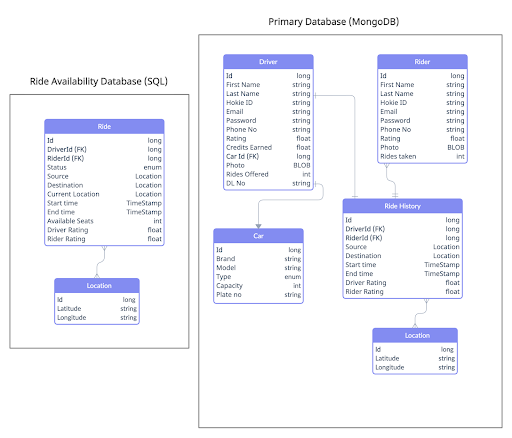

Databases can have two main types: SQL and NoSQL (or relational databases and non-relational databases). They are both different in terms of how they were built, the kind of information they hold, and the storage technique they employ. We will be using MongoDB as our primary database and MySQL or any other relational database as a cache that can provide fast IOs.

For the application to scale for millions of users, databases need to be horizontally scalable so that we can add more servers easily in our NoSQL database infrastructure to handle a lot of traffic. Cloud-based storage is an excellent cost-saving solution but requires data to be easily spread across multiple servers to scale up and databases like MongoDB are designed to be scaled across multiple data centers. The database would have separate collections to store data about various entities on our application i.e. Drivers, Riders, Past Rides, Cars, Location related data which would not be queried that frequently.

However, the driver location information and ride availability status details need to be read and updated frequently to search for available rides. We should be able to prioritize speeds to searching for rides compared to other minor features like fetching ride histories for users. For this purpose, we are storing ride availability status details in a separate database table to increase read writes for the sole purpose of searching for rides. This is called Database caching strategy since it assists in reducing the burden on the primary database. Caches are high-speed data storage layers that keep a subset of the data that is frequently requested for reading. The most typical instance of this is when frequently accessed data is redirected from the main database to the cache itself. The cache itself could be an independent access layer or sit in a database or application. 

<figure>
  
  <figcaption>Prototype of database table design.</figcaption>
</figure>

The diagram above represents a prototype of our database design where the primary database is MongoDB and the cache database i.e. Ride Availability DB is SQL. Primary DB is for storing user related information like Name, Email, HokieID, Rating, etc of both kinds of users i.e. drivers and riders. There would be a separate collection to store the Ride history related data that would consist of driver, riders, source, destination, and other details regarding a specific ride. The location would be stored in terms of latitude and longitude and would constantly be updated for an active ride.

The secondary DB or the cache would have 2 SQL tables to store information about active rides and these tables would frequently get updated and read to determine the availability of rides as per the request from the riders.
Data backups will be made on a daily basis and the data would be replicated across multiple servers to ensure high availability.
