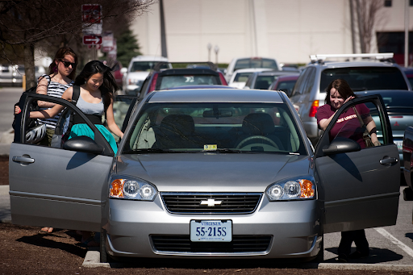

**Project Title:** HokieRide

**Authors:** Aparna Ganesh, Mayur Dhepe, Purna Srivatsa, Rama Krishna Pinnimty

## Background

Our motivation stems from the need of university students trying to find rides when traveling short or long distances, especially during busy days when events take place (e.g game days, fests) or even late nights. It shares close resemblance to existing ride-hailing apps on the market however, our service prioritizes safety and the concept of carpooling more. We aim to address safety by developing HokieRide, an application that includes a verification system for the drivers and riders as authenticated students or faculty of Virginia Tech. In addition, the system will be linked to the campus police department in the case of any emergencies. The details regarding the location of the driver's car and the identity of the driver and passengers during a ride sharing trip will be shared. If successful, we hope to market this service to other universities and recruit members to fine-tune our system as needed for each university. In addition, we’d like to incorporate a credit system for those who offer rides by having some reward provided by the university to encourage carpooling. Our vision is to offer something different than the popular apps like Uber and Lyft by creating an affordable option and allowing students to feel greater safety by riding with their fellow university peers or staff.

The proposed system is relatively novel as it tries to address a unique set of transportation demands and challenges of the university. While there are applications like Uber and Lyft that are developed to primarily serve the general public, rise in their fares poses yet another obstacle for college students. Furthermore, the design of these applications is rather complex with a lot of irrelevant features. Additionally, our system also includes a mechanism to easily reach out to Virginia Tech’s campus police department for additional safety and security.

<figure>
  
</figure>

  <a href="https://vtx.vt.edu/articles/2010/09/091510-tcs-rideboard.html">Students carpooling at Virginia Tech. </a>

