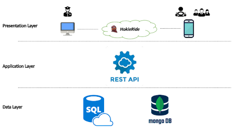

Based on the requirements of the system, we have identified five core components: a non-relational cloud database, a relational cloud database, REST API, a web application and a mobile application. Furthermore, the distribution of these modules into Data, Application and Presentation Layers is done following a 3-tier architectural pattern. The Data Layer is responsible for storage and retrieval of the data. We plan to use MongoDB and SQL cloud databases since it offers high reliability and availability, considering the large number of expected connections. The Application Layer is composed of REST APIs developed internally along with those provided by various third parties (Google Map API etc.). Apart from this, the layer is also responsible for all of the business logic, including authorization and access control. Lastly, the Presentation Layer enables the end-users to interact with the system using web and mobile interfaces. Particularly, the system has to be used by users in mobility, so the access to the system has to be guaranteed by mobile devices. Accordingly, the design of the system architecture takes this into account, and the front-end layer will be designed for mobile devices, considering the major operating systems (iOS and Android). Overall, the applications in the presentation layer communicate with the REST API in the application layer to interact with the data within the databases in the data layer.

As already mentioned, the system follows the mobile-cloud paradigm. The mobile client allows the users (drivers and riders) to access the carpooling service. Its sensors (e.g., GPS) are used to simplify the access to the service and to enhance the user experience. The web client provides useful information concerning trips and users to the police and emergency services. For all communications toward the server, JSON format will be used. The REST API is the core of the system as it enables the access of users, processes all requests, calculates the matching between requests and available drivers and offers rides. Additionally, the push notification services are used to send real-time messages to the smartphones. The cloud database has the task to store all data useful for the service: user profile, ride offers, ride requests, trips, payments, feedback and other information.

<figure>
  
  <figcaption>Three-layer architecture: Presentation Layer, Application Layer, and Data Layer.</figcaption>
</figure>

