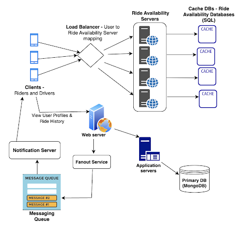
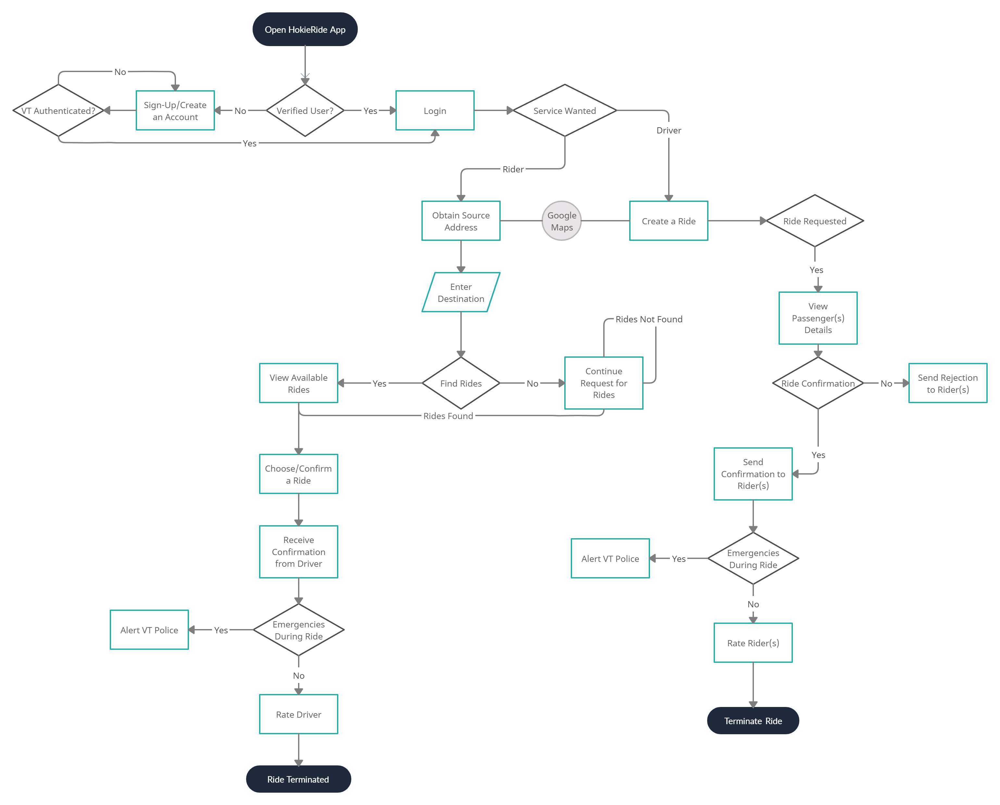

<figure>
  
  <figcaption>System Architecture Diagram</figcaption>
</figure>

The above diagram represents the high level design of HokieRide application. Load balancers will be used to redirect and distribute the traffic to web servers. Web servers would route requests to various application servers like Ride Availability servers, Notification servers, etc. Fanout service would push the data requested or the available rides data to the messaging queue. Cache DBs would be used to store ride availability data for fast retrieval and querying of active rides data. Notification requests from messaging queues would be processed by Notification server and delivered across various channels.

We also propose to use a content delivery network(CDN) that is directly connected to the client or the presentation layer to deliver static files and assets that need not be stored in persistent DBs and accessed from there every time. The architecture would also aim to be stateless in the sense that the state of the client is stored and persisted at the data layer making it accessible to all the servers in the application layer. This allows for every server to operate and process every client and can lead to efficient distribution of requests and load. As the product spreads to multiple universities in different geographic locations, the entire application and data layer can be replicated at the infrastructure level in multiple data centers strategically located to cater best to all the universities that the product serves. We also propose our data layer to be following the master-slave DB architecture where there is one master DB that is used for all write  operations and multiple slave DBs that are used for read operations as in this appplication read operations are more intensive and frequent compared to write operations. The master slave architecture allows for less downtime too as master and each slave maintain data integrity and veracity so that the load can be distributed and a slave can also act as temporary master in the case that the master DB fails. We use a noSQL database for faster serialization and deserialization of data.

## High level Functional Workflow

<figure>
  
  <figcaption>High level Functional Workflow</figcaption>
</figure>