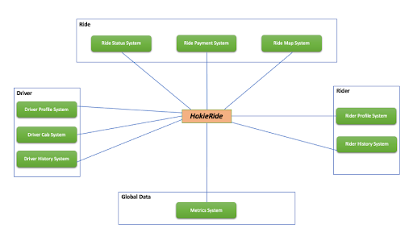
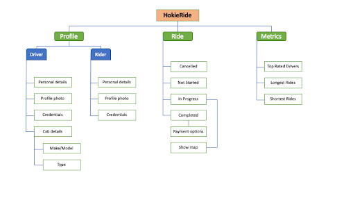

The following sections will go into depth of the design of the four core components. All of the decisions that were made were directly or indirectly in support of the functional and non-functional requirements. Lastly, to realize the design and maintain high customer satisfaction, we aim to use the latest cutting-edge technologies.

The overall system can be broken down into Ride, Driver, Rider, and Global Data components. Specifically, the Ride component will have the Trip Status, Payment and Map interfaces. The Driver component will have interfaces for handling Profile, Cab and History information. The Rider component will have interfaces to process the Profile and History related information. Finally the Global Data component will have an interface to calculate the metrics concerning rides and drivers.

<figure>
  
  <figcaption>System Interface Diagram</figcaption>
</figure>

All the essential functionality in our HokieRide application can be broadly classified as Profile, Ride and Metric related information. First, the Profile functionality is common to both drivers and riders and should include their personal information, profile photo, credentials etc. Additionally, the driver profile should also have details about the model and type of the car they wish to serve the customers. Second, the Ride functionality should always indicate the current status of the trip which could be cancelled, not yet started, in progress, or completed. If the ride is in progress, all the concerned parties should be able to view the estimated time of arrival, map of the ride so far and links to emergency services. And after the successful completion of the trip, the rider should be presented with the total fare and the available payment options. Lastly, to motivate hesitant riders, we plan to show the longest and shortest rides taken by fellow customers to show the flexibility of our service. Also, to reward the drivers, we plan to show information about the top rated drivers within the month and local to a given area.

<figure>
  
  <figcaption>System Functionality Diagram</figcaption>
</figure>

